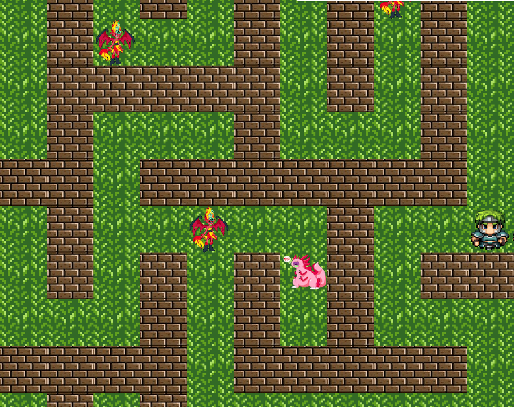

# Yet Another Roguelike

In this game a player controls a powerful hero, crawling through the Maze and killing monsters. Each Maze level is
randomly generated combination of grass and wall tiles. The goal on each level is to kill every monster, and then find a
boss, who holds the key to the next level, and find a door which opens it.

## Main concepts

1. Hero can move in four directions, and attack a monster if they share the same cell.
2. Hero can only move by grass, walls are "solid", and cannot be passed _(some mechanics can be added later, e.g.
   climbing or destroying the walls, or having secret passes)._
3. Monsters AI is reactive, meaning:
    * Monsters move at the same time as hero moves, and their AI is very simple, randomly picking grass tile from
      adjacent _(group behaviour and path finding, following etc. can be added later)._
    * Each hero's attack is counterattacking by the monster at the same time _(attack speed modifiers can be added
      later)_.
4.
5.

### Move

- Move down :arrow_down: or :s:
- Move up :arrow_up: or :w:
- Move right :arrow_right: or :d:
- Move left :arrow_left: or :a:

### Attack

When monster and player occupy the same cell, you can perform an attack by pressing "Space".

### Hero

Face up 
Face Down 
Face Left 
Face Right 

### Boss Monster

### Monster

### Wall

### Game Screenshot

## Engine implementation

The game runs a loop, every cycle updates player position updated by keyboard events, and updates monsters positions in
turn.

## TODOs

1. ~~Add monsters to fight with, and HUD with info~~
2. Refactor HUD to be reactive panels
3. Add boss with next level condition
4. Add levelup feature
5. Inject everything that may be configurable: counts, file paths, sizes, etc
6. Think about Z-axis implementation, with stairs and displaying only particular elevation level rooms