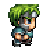

# Role Play Game: Hero vs. Monsters

## Description
Build a hero based walking on tiles and killing monsters type of game. The hero is controlled in a maze using the keyboard. Heroes and monsters have levels and stats depending on their levels. Each level has randomly generated maze and the higher the level is, the more monsters are.

### Move
- Move down :arrow_down: or :s:
- Move up :arrow_up: or :w:
- Move right :arrow_right: or :d:
- Move left :arrow_left: or :a:

### Attack
When monster and hero occupy the same cell, you can perform an attack by pressing "Space".

### Hero
Face up 
Face Down 
Face Left 
Face Right 

### Boss Monster

### Monster

### Wall

### Game Screenshot
